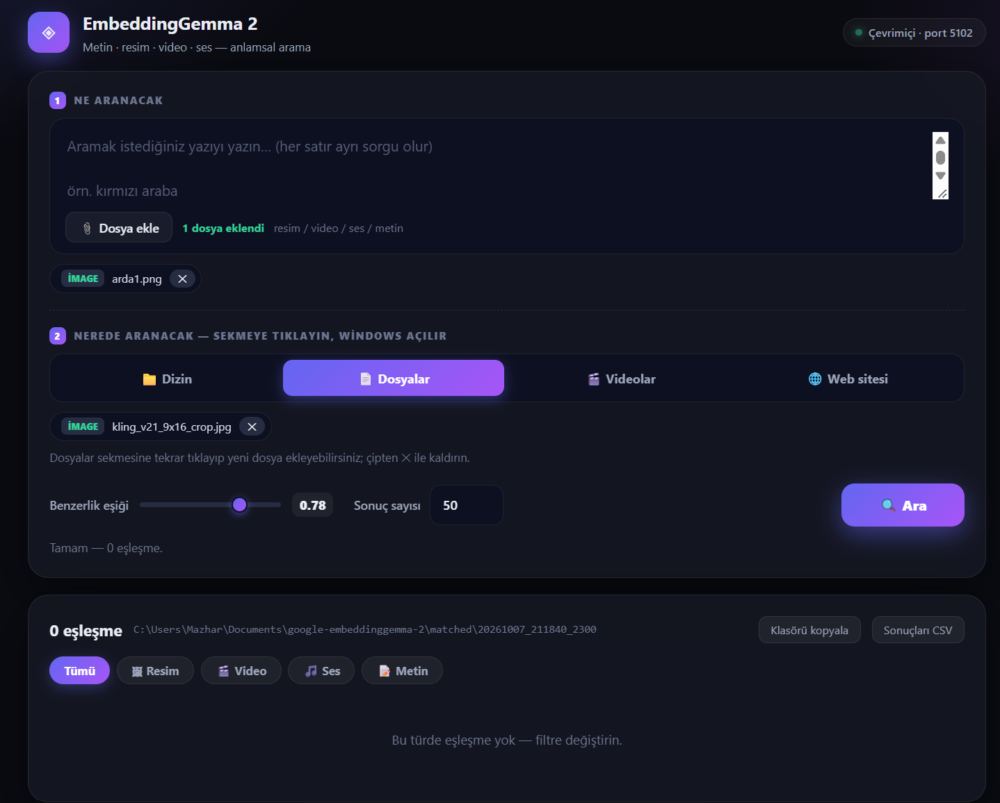

# EmbeddingGemma 2 — Multimodal Semantic Search

[](Demo.mp4)

*Click the screenshot above to watch the demo video (`Demo.mp4`).*

A local web application that searches images, videos, audio files, and text using
**semantic similarity** instead of file names or tags. You describe what you are
looking for — in words or with an example file — and the app finds matching media
across a folder, a file selection, or a web page.

Everything runs **locally on your computer**. No data is uploaded anywhere; the
model, the files, and the results all stay on disk.

---

## What it does

Traditional search matches file names. This app matches **meaning**:

- Type `red car driving fast` and it finds photos/videos that actually show that,
  even if none of the files are named "car".
- Pick an image as the query and it finds visually similar images in a folder.
- Pick a video as the query and it searches frame-by-frame, reporting **which
  timestamp** (`t=00:12`) the match occurred at.
- Pick an audio file and it searches sound segments (30-second slices).
- Query and source can be mixed freely: text + image query, text file, or a
  combination.

**Pipeline:**

1. The query (text, image, video frames, or audio segments) is embedded into a
   768-dimensional vector.
2. Every candidate file in the source is embedded the same way.
   - Videos are sampled at 1 fps (max 12 frames per video).
   - Audio is split into 30-second segments (max 6 per file).
3. Cosine similarity is computed between query and candidate vectors.
4. Matches above the threshold (default 0.50) are copied to `matched/<job>/` and
   shown with their similarity score.

Results stream in as they are found — you do not wait for the whole scan to
finish — and a **Stop** button halts the scan immediately, keeping whatever was
found up to that point.

## The model

| | |
|---|---|
| **Model** | [`google/embeddinggemma-2`](https://huggingface.co/google/embeddinggemma-2) |
| **Dimensions** | 768 (normalized embeddings) |
| **Modalities** | text · image · video · audio — one shared embedding space |
| **Downloaded to** | `./hf_cache` (about 1.5 GB, fetched on first run) |
| **Loader** | `sentence-transformers` with `trust_remote_code=True` |

Because all modalities live in one vector space, a text query can match an image
and an image query can match a video frame. The model version is pinned in
`requirements.txt` (`transformers==5.19.0`) — the custom
`EmbeddingGemma2Processor` requires it, and `torchvision` is a hard dependency of
the image/video preprocessing path.

## Features

- **Query** — free text (multi-line = multiple queries) and/or up to 25 files
  (image, video, audio, text, `.url`), chosen through the native Windows file
  dialog.
- **Sources** — a directory (scanned recursively), a file selection, videos, or a
  web page (media is downloaded and scanned).
- **Live results** — matches appear while the scan is still running; sorted by
  score, capped at the requested result count.
- **Stop button** — halts the scan within milliseconds; partial results are kept
  and a new search can start right away.
- **Result gallery** — thumbnails with a score ring, type badge, and video
  timestamp; filter by type (image / video / audio / text).
- **Preview lightbox** — click a result for a full-size preview (image, video
  player, audio player, or text), navigate with arrow keys, close with Esc.
- **Export** — one-click copy of the output folder path, CSV export of results.
- **Folder picker** — a native Windows Explorer dialog (via PowerShell), plus a
  browse API as fallback.
- **HEIC/HEIF** support (iPhone photos) via `pillow-heif`.

## Requirements

- **Windows 10/11** with Python 3.11–3.14 (native run), or WSL as a fallback
- ~2 GB disk for the model cache + PyTorch
- Internet access on the first run only (model download)

Python packages are listed in `requirements.txt`; key ones are Flask,
sentence-transformers, PyTorch, torchvision, PyAV, librosa, and Pillow.

## Quick start

```
baslat.bat
```

That is it. The script:

1. frees port 5102 if a previous instance is still running,
2. creates the virtual environment (`winvenv`) on first run,
3. installs dependencies from `requirements.txt` (first run downloads PyTorch),
4. starts the server and opens `http://localhost:5102` in your browser.

Startup prints a diagnostics line — `[DIAG] hazir: EmbeddingGemma2Processor OK,
torchvision ...` — which confirms the model's custom processor can load. If a
dependency is missing, the exact package name and install command are printed.

Logs are written to `baslat.log`. Stop the server with `Ctrl+C` in its window.

### Manual start

```
py -3 -m venv winvenv
winvenv\Scripts\pip install -r requirements.txt
winvenv\Scripts\python.exe app.py
```

Then open `http://localhost:5102`.

## Using the app

1. **Ne aranacak (What to search for)** — type a description and/or attach files
   with the file button.
2. **Nerede aranacak (Where to search)** — pick a source tab; the folder/file
   dialog opens immediately:
   - **Directory** — Explorer folder picker; the whole tree is scanned.
   - **Files** — multi-select files (re-click to add more).
   - **Videos** — video-only selection.
   - **Web site** — paste a URL; the page's media is downloaded and scanned.
3. Adjust the **similarity threshold** (0.20–0.99) and **max results** if needed.
4. Press **Ara (Search)**. Results stream in; press **Durdur (Stop)** at any time.
5. Click a result card for a full preview; use the type filters above the grid.

Matched files are copied to `matched/<timestamp>/` inside the project folder.

## HTTP API

| Method | Endpoint | Purpose |
|---|---|---|
| GET | `/` | Web UI |
| GET | `/health` | Version check (`{"ok":true,"v":...}`) |
| POST | `/api/scan` | Start a scan (multipart form) |
| POST | `/api/stop` | Stop the running scan |
| GET | `/api/status` | Progress + streamed results |
| GET | `/api/pickdir` | Native folder-picker dialog (`?dry=1` to probe) |
| GET | `/api/browse` | Directory listing for the file browser |
| GET | `/api/dirs` | Legacy directory listing (compatibility) |
| GET | `/api/file`, `/api/filemeta` | Preview a file / read its metadata |
| GET | `/api/thumb/<job>/<i>` | Result thumbnail |
| GET | `/api/refthumb/<job>/<i>` | Legacy thumbnail alias (compatibility) |
| GET | `/api/matchfile/<job>/<name>` | Full-size matched file |

Scan form fields: `query_text`, `query_files`, `source_type`
(`dir`/`files`/`url`), `source`, `source_files`, `threshold`, `top_k`.

`/api/status` returns `state` (`running` / `done` / `stopped` / `error`),
`phase`, `done`/`total`, `found`, and the `results` array — updated continuously
while the scan runs.

## Project layout

```
├── app.py              # Flask backend: scanning pipeline + API
├── index.html          # Single-page UI (served at /)
├── baslat.bat          # Windows launcher (venv + deps + server)
├── requirements.txt    # Pinned dependencies
├── hf_cache/           # Model cache (~1.5 GB, created on first run)
├── matched/            # Result copies, one folder per scan
├── cache/              # Thumbnails, per-job scratch space
├── test_fixtures/      # Sample images/video/audio for tests
├── test_e2e_dir.py     # End-to-end directory-scan test
└── test_e2e_url.py     # End-to-end URL-scan test
```

## Limits (defaults)

| Setting | Value |
|---|---|
| Candidates per scan | 1500 |
| Query files | 25 |
| Frames per video | 12 (1 fps) |
| Audio segments per file | 6 × 30 s |
| Files listed per folder in the browser | 500 |
| Upload size | 300 MB |

All are constants at the top of `app.py`.

## Troubleshooting

| Symptom | Fix |
|---|---|
| `Could not import module 'EmbeddingGemma2Processor'` | `winvenv\Scripts\pip install torchvision==0.29.1` (or delete `winvenv` and rerun `baslat.bat`) |
| Port 5102 already in use | `baslat.bat` closes the old instance automatically; if it fails: `taskkill /F /IM python.exe` |
| Red banner "Eski sunucu sürümü" | An old server is answering; close its window and rerun `baslat.bat` |
| First scan is slow | The model is downloading to `hf_cache/` (~1.5 GB, one time) |
| Folder picker does not open | Type/paste the path manually into the input field |

## Notes

- The app runs fully offline after the first model download.
- `transformers` and `torchvision` versions are intentionally pinned —
  upgrading them can break the model's custom processor.
- To use CUDA on Windows, reinstall the GPU builds:
  `pip uninstall torch torchvision -y` then
  `pip install torch torchvision --index-url https://download.pytorch.org/whl/cu130`.
